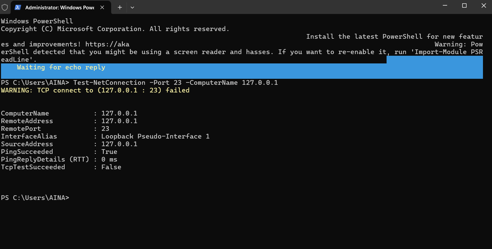
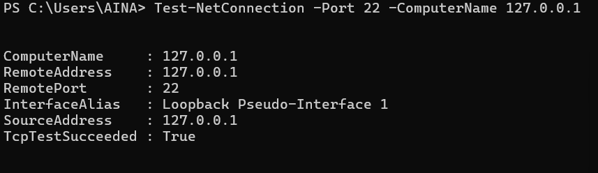

# Task 4: Firewall Setup and Configuration Report

## Overview
This task involved configuring Windows Defender Firewall to control network traffic by creating specific inbound rules for different ports and testing their effectiveness.

## Implementation Steps

### 1. Accessing Windows Defender Firewall
- Opened Windows Defender Firewall with Advanced Security
- Navigated to Inbound Rules section
- Identified current firewall status across all profiles (Domain, Private, Public)

### 2. Creating Block Rule for Telnet (Port 23)
**Rule Configuration:**
- **Type:** Port-based rule
- **Protocol:** TCP
- **Port:** 23 (Telnet)
- **Action:** Block the connection
- **Profiles:** Applied to Domain, Private, and Public networks
- **Name:** "Block Telnet Port 23"

### 3. Creating Allow Rule for SSH (Port 22)
**Rule Configuration:**
- **Type:** Port-based rule  
- **Protocol:** TCP
- **Port:** 22 (SSH)
- **Action:** Allow the connection
- **Profiles:** Applied to all network profiles
- **Name:** "Allow SSH"

## Testing and Validation

### PowerShell Connection Tests
Used `Test-NetConnection` cmdlet to verify rule effectiveness:

**Telnet (Port 23) - Blocked:**
```powershell
Test-NetConnection -Port 23 -ComputerName 127.0.0.1
```
- **Result:** TCP connect failed ✅
- **Status:** TcpTestSucceeded = False
 
  

**SSH (Port 22) - Allowed:**
```powershell
Test-NetConnection -Port 22 -ComputerName 127.0.0.1
```
- **Result:** TCP connect succeeded ✅
- **Status:** TcpTestSucceeded = True

 

## Key Findings

1. **Rule Priority:** Custom rules take precedence over default settings
2. **Profile Coverage:** Rules applied across all network profiles ensure consistent security
3. **Immediate Effect:** Firewall rules are applied instantly without requiring system restart
4. **Testing Validation:** PowerShell provides reliable method for testing port accessibility

## Security Benefits

- **Controlled Access:** Specific ports can be selectively blocked or allowed
- **Attack Surface Reduction:** Blocking unused services (like Telnet) reduces potential entry points
- **Flexible Management:** Rules can be easily modified, disabled, or deleted as needed
- **Comprehensive Coverage:** Rules apply regardless of network location (domain/private/public)

## Conclusion

Successfully configured Windows Defender Firewall rules to:
- Block potentially insecure Telnet connections (Port 23)
- Allow secure SSH connections (Port 22)
- Verified functionality through PowerShell testing

The firewall configuration provides effective network traffic control while maintaining necessary service accessibility.
